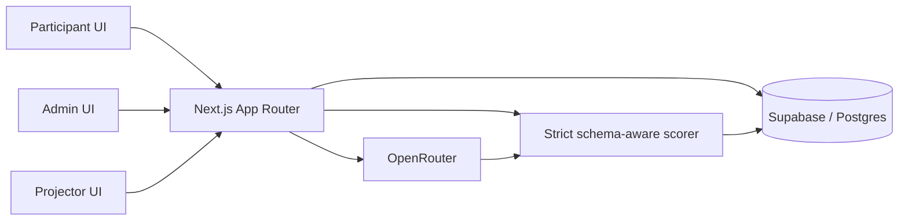

# The Great Prompt-Off

The Great Prompt-Off is a full-stack workshop platform for running a live prompt-engineering challenge. Participants design clinical extraction strategies for synthetic, non-PHI knee MRI reports, test them on a public set, and submit once against a hidden final set.

The project is a production-oriented prototype built to explore evaluation design, schema-driven scoring, privacy boundaries, live-event operations, and safe AI integration.

[View the deployed application](https://the-great-prompt-off.vercel.app) | [Architecture](PROJECT_ARCHITECTURE.md) | [10-minute demo checklist](PROJECT_DEMO_CHECKLIST.md)

> The public deployment shows the participant entry screen. Participant access codes and the admin secret are intentionally not included in this repository.

## What The Project Demonstrates

- A complete participant workflow with access-code sessions, saved prompt drafts, public Test Attempts, and a one-time Final Submission.
- Server-side event controls for practice, final, ended, announcements, timers, and leaderboard visibility.
- Strict, explainable scoring over schema-defined fields and controlled labels.
- OpenRouter evaluation with a hidden output contract, strategy gating, concurrency limits, timeouts, and participant-safe error messages.
- Supabase/Postgres persistence for reports, versioned answer keys, runs, submissions, event configuration, and admin operations.
- Forward-compatible challenge schemas, provenance-aware answer-key readiness, guarded activation, and immutable run snapshots.
- An isolated deterministic Simulation Lab with batch history, analytics, comparisons, CSV exports, and reference regression checks.
- Security-focused details including server-only credentials, prompt length limits, CSV formula protection, admin route guards, and private final-result sanitization.
- A Vitest regression suite covering scoring, schemas, activation safeguards, simulations, and privacy-sensitive response shapes.

## Current Challenge

The active mode is `knee_mri_6_basic` v1. It scores six findings:

```text
acl_tear
mcl_injury
meniscus_tear
fracture
osteoarthritis
effusion
```

Each field accepts exactly one controlled value:

```text
present | absent | uncertain | not_reported
```

The scorer allows structural JSON recovery, but it does not translate clinical phrases such as `intact`, `partial tear`, `trace`, `yes`, or `no` into accepted labels. `not_reported` is distinct from `absent`: silence or insufficient evidence is not an explicit negative finding.

Two future schemas, `knee_mri_12_basic` and `shoulder_mri_basic`, are present for compatibility tests and rehearsal tooling. They are dormant, not activation-allowlisted, and not available to participants.

## User Flows

### Participant

1. Enter an organizer-issued access code.
2. Wait for the organizer to open practice.
3. Write a clinical extraction strategy; the platform supplies the output-format contract.
4. Use counted Test Attempts against five public reports and review sanitized diagnostics.
5. Submit once during the final phase against 45 hidden reports.
6. See aggregate final status and score without private reports, answer keys, or raw final model output.

### Organizer

1. Sign in at `/admin` with the server-configured admin secret.
2. Verify Supabase, report coverage, answer keys, model configuration, and event cleanliness.
3. Control phases, leaderboard visibility, announcements, and the display-only timer.
4. Monitor participant progress, grant a narrow extra Test Attempt, and manage event data.
5. Run public-report model calibration and schema-readiness preflights.
6. Use `/admin/simulations` for isolated deterministic rehearsals that never enter real event results.
7. Export results and finish with the projector leaderboard at `/display/leaderboard`.

## Architecture



- **View:** participant, admin, analytics, simulation, and projector pages in `app/`.
- **Controller:** App Router handlers in `app/api/` and server workflows in `app/lib/supabase/`.
- **Model:** Supabase tables plus the challenge schema registry in `app/lib/challenge-modes.ts`.
- **Evaluation:** the server sends the participant strategy and synthetic report to OpenRouter, then independently validates and scores the returned JSON.

Public Test Attempts and Final Submissions use the same scorer. Practice leaderboards rank each participant's best public attempt; final and ended leaderboards use Final Submission scores only.

For a table-by-table explanation and complete data flow, see [PROJECT_ARCHITECTURE.md](PROJECT_ARCHITECTURE.md).

## Data And Privacy Boundaries

Supabase is the live source of truth after seeding:

- `reports` stores synthetic report text and the public/private split.
- `answer_keys` stores versioned, server-only expected labels and provenance.
- `prompt_runs` and `prompt_run_items` store evaluation metadata and per-report results.
- `submissions` stores counted Test Attempts and Final Submissions.
- `simulation_*` tables store isolated deterministic rehearsal data only.

Local synthetic report files are kept in `seed-data/mock-reports/`, outside `public/`. They are seed/development assets and are not directly served by Next.js.

Participant responses never include answer keys, private report text, access-code lists, hidden system instructions, server secrets, or raw final model outputs. Supabase service-role credentials and the OpenRouter API key are used only in server code.

## Tech Stack

- Next.js 16 App Router
- React 19 and TypeScript
- Tailwind CSS 4
- Supabase/Postgres
- OpenRouter chat-completions API
- Vitest and ESLint
- Vercel deployment and cron
- GitHub Actions keep-alive workflow

## Run Locally

### Prerequisites

- Node.js `20.9.0` or newer
- npm
- A Supabase project
- An OpenRouter API key only if real model evaluation is enabled

### 1. Clone and install

```bash
git clone https://github.com/EthanChenHyland/the-great-prompt-off.git
cd the-great-prompt-off
npm ci
```

### 2. Configure the environment

Copy `.env.example` to `.env.local`:

```powershell
Copy-Item .env.example .env.local
```

On macOS/Linux:

```bash
cp .env.example .env.local
```

Configure these values without committing `.env.local`:

| Variable | Required | Purpose |
| --- | --- | --- |
| `NEXT_PUBLIC_SUPABASE_URL` | Yes | Supabase project URL. |
| `NEXT_PUBLIC_SUPABASE_ANON_KEY` | Yes | Browser-safe Supabase key for the client helper. Never substitute the service-role key. |
| `SUPABASE_SERVICE_ROLE_KEY` | Yes | Server-only database access for protected workflows and seeding. |
| `ADMIN_SECRET` | Yes | Protects `/admin` and admin mutation routes. |
| `PARTICIPANT_SESSION_SECRET` | Recommended | Signs participant session tokens. If omitted, the server falls back to the service-role key. |
| `USE_REAL_LLM` | Yes | `true` uses OpenRouter; any other value uses the deterministic local evaluator. |
| `OPENROUTER_API_KEY` | When `USE_REAL_LLM=true` | Server-only OpenRouter credential. |
| `OPENROUTER_MODEL` | Recommended | Fallback model when the active challenge has no approved override. |
| `OPENROUTER_CONCURRENCY` | Optional | Concurrent report evaluations, clamped from 1 to 10; default is 3. |
| `ALLOW_LOCAL_FALLBACK` | Optional | Development-only fallback. Keep `false` in production so database failures fail closed. |
| `KEEPALIVE_SECRET` | Optional | Protects the read-only Supabase health endpoint and scheduled pings. |

`EVENT_PHASE` and `LEADERBOARD_VISIBILITY` are optional seed-time overrides. Their defaults are `not_started` and `practice`.

### 3. Prepare Supabase

For a new project:

1. Run `supabase/schema.sql` in the Supabase SQL Editor.
2. Apply the current additive migrations listed in [SUPABASE_MIGRATIONS_GUIDE.md](SUPABASE_MIGRATIONS_GUIDE.md) and [PROJECT_DEMO_CHECKLIST.md](PROJECT_DEMO_CHECKLIST.md).
3. Verify the expected columns, RPCs, and answer-key coverage with the SQL in those guides.

App code does not apply SQL migrations automatically. `supabase/schema.sql` is the baseline schema, not a replacement for every later migration.

Seed the synthetic workshop dataset:

```bash
npm run seed:supabase
```

The seed command upserts one active challenge, 50 synthetic reports, versioned six-field answer keys, and 50 mock participants. It preserves participant access codes only when they already match the current format. Review the target Supabase project before running it, especially against production.

### 4. Start the application

```bash
npm run dev
```

Open [http://localhost:3000](http://localhost:3000). Useful local routes:

- `/` participant entry
- `/challenge` participant workspace
- `/admin` organizer dashboard
- `/admin/analytics` workshop analytics and model calibration
- `/admin/cases` report and active answer-key management
- `/admin/simulations` isolated deterministic simulation lab
- `/display/leaderboard` projection-friendly leaderboard

## Commands

| Command | Purpose |
| --- | --- |
| `npm run dev` | Start the local Next.js development server. |
| `npm run test` | Run the Vitest regression suite once. |
| `npm run lint` | Run ESLint. |
| `npm run build` | Create a production build. |
| `npm run start` | Serve an existing production build. |
| `npm run seed:supabase` | Upsert the synthetic challenge dataset into the configured Supabase project. |

Before deploying or rehearsing an event, run:

```bash
npm run test
npm run lint
npm run build
```

## Deployment

The repository is designed for Vercel:

1. Import the GitHub repository into Vercel.
2. Configure the same environment variables for the intended environment.
3. Apply and verify Supabase migrations separately.
4. Seed only the intended database.
5. Deploy and complete [DEMO_CHECKLIST.md](DEMO_CHECKLIST.md).

`vercel.json` calls the read-only `/api/health/supabase` endpoint daily. `.github/workflows/supabase-keepalive.yml` provides a backup ping every six hours and defaults to the deployed project URL. These pings make no database writes and no OpenRouter calls; they are a development convenience, not an event-readiness check.

## Repository Guide

- [PROJECT_ARCHITECTURE.md](PROJECT_ARCHITECTURE.md): system design, tables, APIs, and data flow.
- [PROJECT_DEMO_CHECKLIST.md](PROJECT_DEMO_CHECKLIST.md): concise advisor demo and staging rehearsal.
- [DEMO_CHECKLIST.md](DEMO_CHECKLIST.md): full live-event run of show.
- [SUPABASE_MIGRATIONS_GUIDE.md](SUPABASE_MIGRATIONS_GUIDE.md): SQL migrations and verification.
- [REPORT_IMPORT_GUIDE.md](REPORT_IMPORT_GUIDE.md): versioned answer-key import and provenance workflow.
- [SIMULATION_GUIDE.md](SIMULATION_GUIDE.md): deterministic simulation architecture and endpoints.
- [MEETING_UPDATE.md](MEETING_UPDATE.md): project progress mapped to advisor feedback.

## Current Limitations

- This is a workshop prototype, not a clinical diagnostic system.
- The included reports are synthetic and the current six-field dataset is for demonstration and calibration.
- The twelve-field knee and shoulder schemas are dormant; real clinician-adjudicated twelve-field data is not included.
- Simulation is deterministic and synthetic. It is useful for regression rehearsal, not a real-LLM benchmark or clinical validation.
- Expensive and sensitive routes have natural attempt/session guards but do not yet use a distributed rate limiter.
- Model evaluation is synchronous; a larger final report set may need a background queue.
- The test suite focuses on pure logic, route contracts, safeguards, and static privacy regressions rather than full browser or live-Supabase integration tests.

## License

This project is available under the [MIT License](LICENSE).
